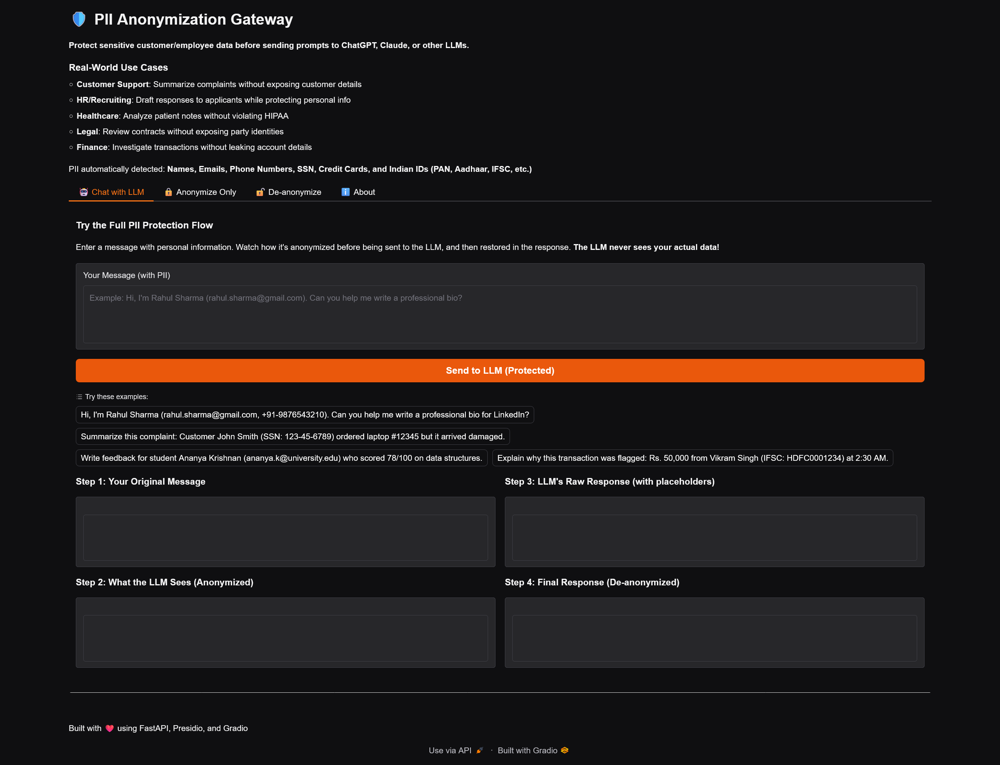

# PII Anonymization Gateway 

**Protect sensitive personal information before sending prompts to LLMs like ChatGPT, Claude, or Gemini.**

##  What Does This Do?
  
This application demonstrates how to safely use Large Language Models (LLMs) with sensitive data by:
1. **Detecting PII** - Automatically finds names, emails, phone numbers, SSN, Indian IDs (PAN, Aadhaar, etc.)
2. **Anonymizing** - Replaces PII with placeholders like `[PERSON_1]`, `[EMAIL_ADDRESS_1]`
3. **Safe LLM Queries** - Sends anonymized text to Gemini (the LLM never sees real data!)
4. **De-anonymizing** - Restores original PII in the LLM's response

##  Real-World Use Cases

- **Customer Support**: Summarize complaints without exposing customer details
- **HR/Recruiting**: Draft responses while protecting applicant information
- **Healthcare**: Analyze patient notes without violating HIPAA
- **Legal**: Review contracts without exposing party identities
- **Finance**: Investigate transactions without leaking account details
- **Education**: Process student data securely

##  Try It Out

1. Go to the **" Chat with LLM"** tab
2. Enter a message with personal information
3. Watch how your data is protected in real-time!
4. See the full anonymization → LLM → de-anonymization flow

##  Technology Stack

- **PII Detection**: Microsoft Presidio
- **NLP Model**: spaCy (en_core_web_lg)
- **LLM**: Google Gemini (via OpenAI-compatible API)
- **Frontend**: Gradio
- **Backend**: Python + FastAPI

##  Supported PII Types

**Standard**: Names, Emails, Phone Numbers, Credit Cards, SSN, Dates, Locations, IP Addresses

**Indian**: PAN, Aadhaar, IFSC, GST, Voter ID, Passport, Driving License, Bank Accounts

##  Note

This is a **portfolio demo project**. The LLM chat feature uses Gemini's free tier API. For production use, implement proper rate limiting, Redis for session storage, and enterprise API keys.

##  Links

- **Hugging-Face**: [PII-Anonymization](https://huggingface.co/spaces/VikasURao/pii-anonymization-gateway)
- **LinkedIn**: [Vikas U Rao](https://www.linkedin.com/in/vikas-u-rao)

---

Built by Vikas U Rao
